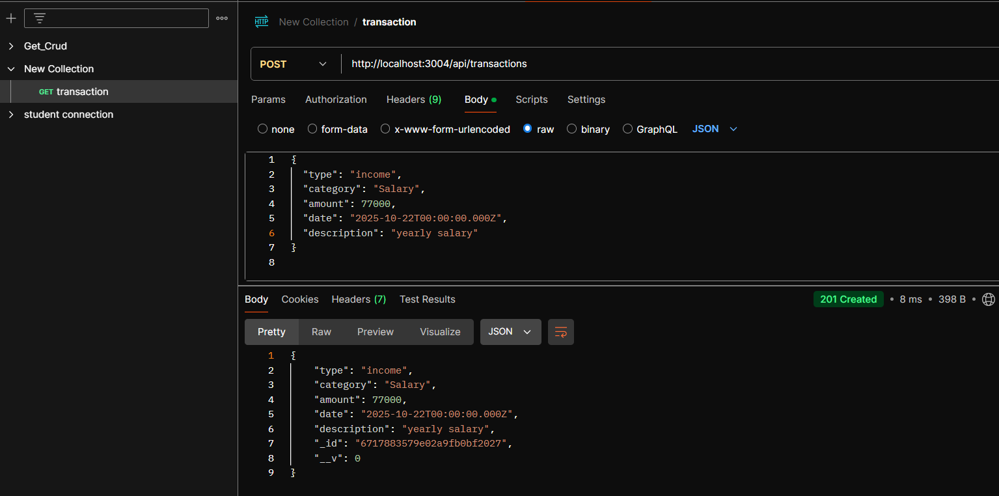
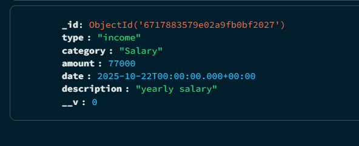
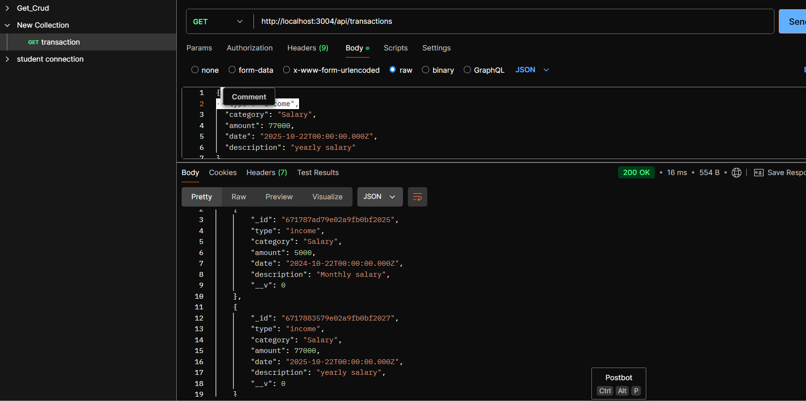
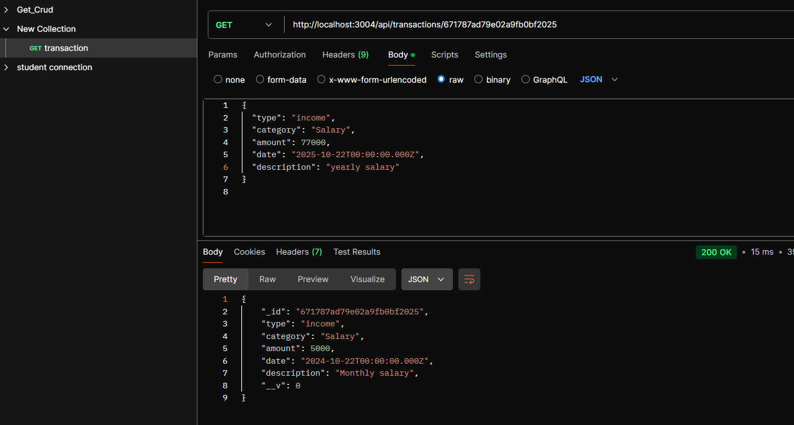
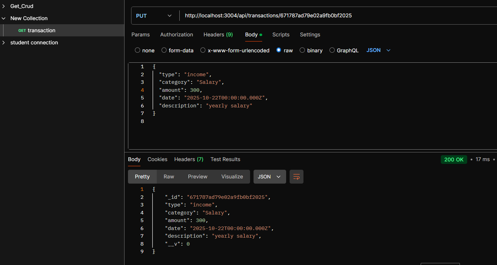
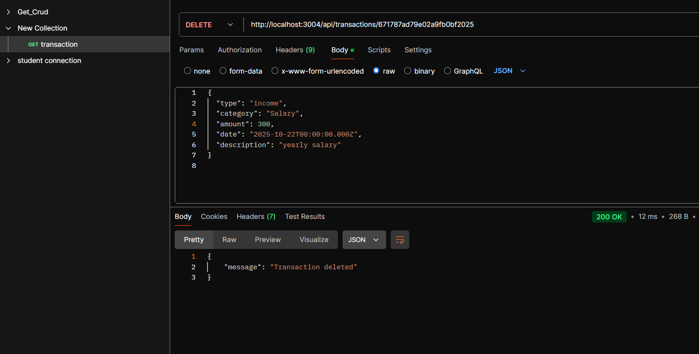

POST Method :-

Description: Adds a new transaction (either income or expense).
Method: POST
URL: http://localhost:3004/api/transactions

-----------------------------------------------------------

GET Method :-

Description: Retrieves a list of all transactions.

Method: GET

URL: http://localhost:3004/api/transactions

----------------------------------------------------

Method: GET

URL: http://localhost:3004/api/transactions/{id}

Replace {id} with the actual transaction ID, e.g., 671787ad79e02a9fb0bf2025

------------------------------------------------------

Description: Updates an existing transaction based on the provided ID.

Method: PUT

URL: http://localhost:3004/api/transactions/{id}

Replace {id} with the actual transaction ID, e.g., 671787ad79e02a9fb0bf2025.

-------------------------------------------------------

Description: Deletes a transaction based on the provided ID.

Method: DELETE

URL: http://localhost:3004/api/transactions/{id}

Replace {id} with the actual transaction ID, e.g., 671787ad79e02a9fb0bf2025.

---------------------------------------------------

The Personal Expense Tracker API is a backend service built using Node.js and Express.js, with MongoDB as the database. This project allows users to manage their personal financial transactions by recording incomes and expenses. It supports CRUD (Create, Read, Update, Delete) operations on transactions and provides summary reports to help users track their finances.

Key Features:

Add Transactions: Users can log both income and expense transactions.

Retrieve Transactions: View a list of all transactions or a specific transaction by ID.

Update Transactions: Modify details of an existing transaction.

Delete Transactions: Remove a transaction from the system.

Summary Report: Get a summary of total income, total expenses, and balance, with optional filters by date or category.